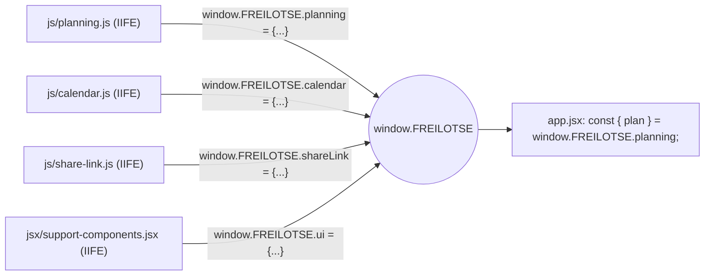
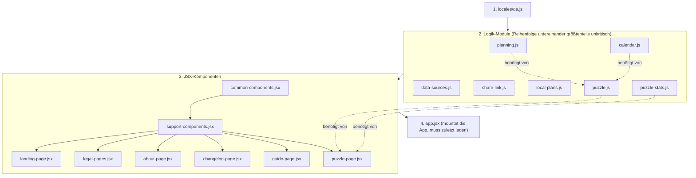
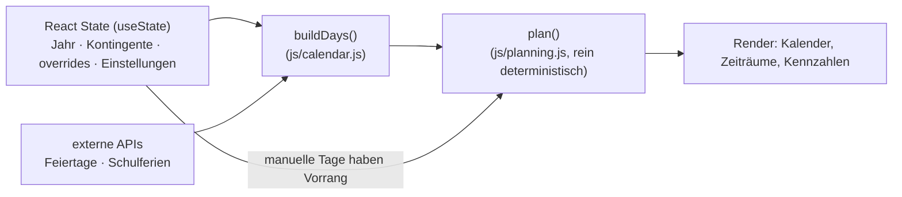
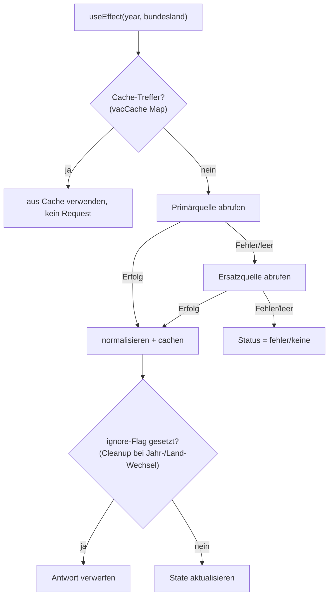
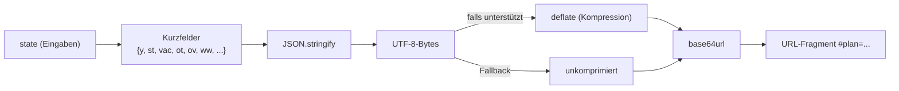
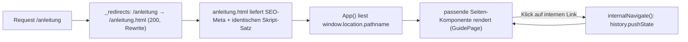
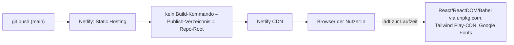

# IT-Konzept FREILOTSE

> Dieses Dokument beschreibt FREILOTSE aus technischer Sicht: Architektur,
> Datenflüsse, Schnittstellen, Deployment. Es ergänzt das
> [`Fachkonzept`](./FACHKONZEPT.md) (Produktsicht) und die
> [`CLAUDE.md`](../CLAUDE.md) im Repository-Root, die dieselben Regeln als
> verbindliche, sehr detaillierte Arbeitsanweisung für Änderungen am Code
> enthält. Bei Widersprüchen gilt der tatsächliche Code als Quelle der
> Wahrheit; dieses Dokument ist eine strukturierte Zusammenfassung, keine
> Ersatz-Spezifikation.

## 1. Zweck und Einordnung

FREILOTSE ist bewusst **ohne Build-Schritt** umgesetzt: eine reine
React/JSX-Anwendung, die direkt im Browser läuft, über CDN eingebundenes
React sowie Babel-Standalone für die JSX-Übersetzung zur Laufzeit. Es gibt
keinen Bundler, kein npm, kein TypeScript. Dieses IT-Konzept dokumentiert,
wie aus dieser bewussten Einschränkung heraus dennoch eine wartbare,
modulare Architektur entsteht, welche externen Abhängigkeiten bestehen und
wie die Anwendung ausgeliefert wird.

## 2. Technologie-Stack

| Baustein | Technologie | Einbindung |
|---|---|---|
| UI-Framework | React 18 / ReactDOM 18 | CDN (`unpkg.com`), `production.min.js` |
| JSX-Übersetzung | Babel Standalone 7 | CDN, `type="text/babel"` pro `<script>` |
| CSS-Utilities | Tailwind CSS (Play-CDN) | CDN, Inline-Konfiguration (Farbpalette, Fonts) in `index.html` |
| Ergänzendes CSS | `css/theme.css` | statisches Stylesheet für Effekte, die Tailwind-Utilities nicht abdecken (Wellen-Motiv, warme Schatten) |
| Schriften | Figtree, Manrope, Space Mono | Google Fonts, per `<link>` geladen |
| Sprache | Deutsch (einzige aktive Locale) | `window.I18N`, siehe Abschnitt 9 |

Es existiert **kein** `package.json`, **kein** Bundler-Konfigurationsfile.
Jede Quelldatei ist ein eigenständig ladbares `<script>`-Tag; JS-Dateien
regulär, JSX-Dateien mit `type="text/babel" data-presets="react"`.

## 3. Architekturprinzip: Namespace statt Modulsystem

Da klassische `<script>`-Tags sich dieselbe globale lexikalische Umgebung
teilen, würde eine mehrfache `const`/`let`-Deklaration desselben Namens in
verschiedenen Dateien zu einem `SyntaxError` führen. FREILOTSE löst das
durch ein einheitliches Muster:

- Jede Datei kapselt sich in eine **IIFE** (Immediately Invoked Function
  Expression).
- Die öffentliche Oberfläche einer Datei wird explizit an einen
  `window.FREILOTSE.*`-Namespace gehängt (z. B. `window.FREILOTSE.planning`,
  `window.FREILOTSE.calendar`), statt eigene Bezeichner auf oberster Ebene
  zu deklarieren.
- `app.jsx` holt sich die benötigten Funktionen/Komponenten zu Beginn per
  Kurzschreibweise zurück, z. B.
  `const { plan, minimalBridgeBudget } = window.FREILOTSE.planning;`

Dieses Muster ersetzt ES-Module vollständig, ohne dass ein Bundler nötig
wäre, und hält gleichzeitig jede Datei in sich geschlossen testbar.

## 4. Datei- und Verzeichnisstruktur

| Pfad | Namespace | Verantwortung |
|---|---|---|
| `locales/de.js` | `window.I18N` | Übersetzungen, `t(key, params)`, Locale-Infrastruktur. Muss als Erstes geladen werden. |
| `js/planning.js` | `window.FREILOTSE.planning` | `plan()`, `minimalBridgeBudget()` — rein deterministisch, kein React, kein DOM, kein `fetch()` |
| `js/calendar.js` | `window.FREILOTSE.calendar` | `DAY`, `easterUTC()`, `holidayMap()`, `buildDays()`, `vacationDayMap()` — reine Kalenderlogik |
| `js/data-sources.js` | `window.FREILOTSE.dataSources` | Anbindung externer APIs (Feiertage, Schulferien), Normalisierer |
| `js/share-link.js` | `window.FREILOTSE.shareLink` | Kodierung/Dekodierung/Validierung des Share-Link-Formats |
| `js/local-plans.js` | `window.FREILOTSE.localPlans` | Reine Speicherhülle für mehrere lokal gespeicherte Pläne (kein direkter `localStorage`-Zugriff) |
| `js/puzzle.js` | `window.FREILOTSE.puzzle` | Deterministische Erzeugung des täglichen Rätsels (seedet aus Datum) |
| `js/puzzle-stats.js` | `window.FREILOTSE.puzzleStats` | Reine Speicherhülle für Rätsel-Statistik |
| `jsx/common-components.jsx` | `window.FREILOTSE.ui` | `CollapsibleCard`, `InfoHint` |
| `jsx/support-components.jsx` | `window.FREILOTSE.ui` | Site-Chrome: `SiteLink`, `SiteFooter`, `SupportFloatingButton`, `internalNavigate` |
| `jsx/landing-page.jsx`, `legal-pages.jsx`, `about-page.jsx`, `changelog-page.jsx`, `guide-page.jsx`, `puzzle-page.jsx` | `window.FREILOTSE.ui` | Eigenständige Seiten-Komponenten |
| `app.jsx` | – (Wurzel) | `Urlaubsplaner` (zentrale Komponente), `App` (Routing), Mount via `ReactDOM.createRoot(...)` |
| `index.html`, `anleitung.html`, `neuigkeiten.html`, `ueber-freilotse.html`, `raetsel.html`, `impressum.html`, `datenschutz.html` | – | Statische Seiten-Shells mit routenspezifischen Meta-/OG-Tags, laden identischen Skript-Satz |
| `assets/`, `css/` | – | Bilder/Logos, ergänzendes CSS |

## 5. Lade- und Abhängigkeitsreihenfolge

Die Reihenfolge der `<script>`-Tags in jeder HTML-Shell ist verbindlich,
da spätere Dateien auf früher gesetzte `window.FREILOTSE.*`- bzw.
`window.I18N`-Objekte zugreifen:

Einzige Ausnahme von der sonst abhängigkeitsfreien Reihenfolge der
Logik-Module: `js/puzzle.js` setzt `js/calendar.js` **und**
`js/planning.js` voraus. Bei Änderungen an einer Datei wird die
Cache-Busting-Version in der jeweiligen HTML-Shell (`?v=…`) hochgezählt,
damit Browser- und CDN-Caches die neue Version zuverlässig laden.

## 6. Zustandsmodell und Datenfluss

Der zentrale Grundsatz: **Der Urlaubsplan ist eine reine Ableitung, kein
gespeicherter Datenbestand.** React-`useState`-Hooks in `Urlaubsplaner`
halten ausschließlich Eingaben (Kontingente, `overrides`-Map, Einstellungen);
`plan(days, cfg)` (`js/planning.js`) berechnet daraus bei jeder relevanten
Änderung das komplette Ergebnis neu.

`overrides` ist eine Map `"JAHR:m-d" → "vac" | "ot" | "none"` — der einzige
persistierte Eingriffspunkt für manuelle Tage. Automatische Tage
(`result.sel[]`, `result.origin[]`) werden **nicht** persistiert, sondern
bei jedem Render deterministisch neu berechnet. `plan()` selbst ist frei
von React-, DOM- und Netzwerkzugriffen und daher unabhängig testbar.

## 7. Externe Schnittstellen und Ausfallsicherheit

`js/data-sources.js` kapselt zwei externe HTTP-Integrationen:

- **Feiertage**: OpenHolidays-API (`PublicHolidays`-Endpunkt). Bei
  Nichterreichbarkeit greift `holidayMap()` (`js/calendar.js`) als
  vollständige Offline-Berechnung — **keine** Netzwerkabhängigkeit für die
  Kernfunktion.
- **Schulferien**: primär OpenHolidays `SchoolHolidays`, sekundär
  `schulferien-api.de` als automatischer Fallback (deckt frühere/spätere
  Jahre ab, die die Primärquelle nicht abdeckt). Beide Antwortformate werden
  unmittelbar nach dem Abruf auf ein gemeinsames internes Format
  normalisiert (`normalizeOpenHolidaysPeriod` / `normalizeSchulferienApiPeriod`).

Das `ignore`-Flag im `useEffect`-Cleanup verhindert Race Conditions: Eine
verspätet eintreffende Antwort einer bereits verlassenen Kombination aus
Jahr/Bundesland überschreibt nicht den inzwischen aktuelleren Zustand
(identisches Muster für Feiertags- und Schulferienabfrage).

## 8. Persistenzmechanismen

FREILOTSE hat **kein Backend** und **keine Datenbank**. Es existieren drei
rein clientseitige Persistenzformen:

### 8.1 Share-Link (URL-Fragment, kein Speicher)

`SHARE_VERSION` versioniert das Format; neue Felder (z. B. `ww` für
regelmäßige Arbeitstage) werden additiv ergänzt, sodass ältere Links ohne
das Feld weiterhin gültig bleiben. `SHARE_MAX_URL` (8000 Zeichen),
`SHARE_MAX_DECODED`, `SHARE_MAX_OVERRIDES` und `SHARE_MAX_BLOCKS` begrenzen
Payload-Größe zur Absicherung gegen kaputte/böswillig große Links.
`decodeShare()`/`validateSharePayload()` sind reine Funktionen ohne
Zugriff auf Fenster-/Session-Zustand und daher sicher zum Dekodieren
fremder Links (siehe „Gemeinsam frei" im Fachkonzept) nutzbar.

### 8.2 `localStorage` (zwei unabhängige Speicherhüllen)

| Schlüssel | Modul | Inhalt |
|---|---|---|
| `freilotse.localPlans.v1` | `js/local-plans.js` | `{ plans: [{id, name, createdAt, updatedAt, payload}], activePlanId }` — `payload` ist strukturgleich zur Share-Link-Hülle |
| `freilotse.puzzleStats.v1` | `js/puzzle-stats.js` | Streak, Spielverlauf inkl. Emoji-Grid pro Tag |

Beide Module fassen `localStorage` selbst **nicht** an — das bleibt in
`app.jsx` bzw. `puzzle-page.jsx` — und liefern nur reine
Parse-/Serialize-/Mutations-Funktionen. Alle Schreibzugriffe sind mit
`try/catch` abgesichert; ist `localStorage` nicht verfügbar, blendet sich
das jeweilige Feature vollständig aus statt einen Fehlerzustand zu zeigen.

## 9. Internationalisierung (technisch)

`window.I18N` (`locales/de.js`) stellt `t(key, params)`,
`setLocale`/`getLocale` sowie `registerLocale()` für spätere weitere
Sprachen bereit. `locales/en.js` existiert als **inaktive** Strukturvorlage,
wird aktuell nicht geladen. Fehlt ein Schlüssel in der aktiven Sprache,
fällt `t()` auf Deutsch zurück; fehlt er dort ebenfalls, liefert `t()`
sichtbar `⚠ <key>` plus Konsolen-Warnung — nie ein stiller Absturz. Jede
nutzersichtbare Zeichenkette muss laut verbindlicher Projektregel über
`t()` laufen (siehe `CLAUDE.md`, Abschnitt „Internationalisierung").

## 10. Routing und Mehrseiten-Struktur

Für Netlify als reines statisches Hosting ohne Server-Rendering kombiniert
FREILOTSE zwei Techniken:

1. **Physische HTML-Shells** pro Route (`index.html`, `anleitung.html`,
   `neuigkeiten.html`, `ueber-freilotse.html`, `raetsel.html`,
   `impressum.html`, `datenschutz.html`, `nutzungsbedingungen.html`) — jede
   mit eigenen, statisch gerenderten `<title>`/`<meta description>`/
   Open-Graph-Tags für Suchmaschinen und Social-Share-Vorschauen, aber
   identischem Skript-Ladepfad.
2. **Client-seitiges Routing** in `App()` (`app.jsx`) über
   `window.location.pathname` plus `popstate`-Listener; interne Links
   navigieren über `internalNavigate()` (`history.pushState`) ohne
   vollständigen Seiten-Reload.

`_redirects` (Netlify-Syntax) mappt jede „schöne" URL per **Rewrite**
(Statuscode 200, kein 302) auf die physische Datei, sodass sowohl direkte
Aufrufe als auch Client-Navigation funktionieren.

## 11. Deployment und Hosting

Es gibt keine CI/CD-Pipeline im klassischen Sinn (kein Test-/Build-Schritt
vor Deployment) — jeder Push auf `main` ist unmittelbar live. Das ist eine
bewusste Konsequenz des bundlerfreien Ansatzes: Es gibt nichts zu
kompilieren, das fehlschlagen könnte. Qualitätssicherung erfolgt manuell
bzw. durch Review vor dem Push.

`freilotse.de` ist als primäre Custom Domain in Netlify hinterlegt (DNS
zeigt direkt auf Netlify); `freilotse.netlify.app` bleibt zusätzlich
erreichbar. Es findet **kein** Redirect zwischen den beiden Domains mehr
statt (historisch leitete `_redirects` `freilotse.de` per 302 auf
`freilotse.netlify.app` um, diese Zeile wurde entfernt).

## 12. Sicherheit und Datenschutz (technisch)

- **Keine serverseitige Datenhaltung**: Es existiert kein eigenes Backend,
  das personenbezogene Daten empfangen könnte.
- **Keine Cookies, kein Tracking** für die Kernfunktion.
- **Share-Links sind Klartext-kodiert, nicht verschlüsselt**
  (`base64url`) — bewusst dokumentiert, damit niemand fälschlich von
  Vertraulichkeit ausgeht; die Nutzer:in wird beim Teilen explizit darauf
  hingewiesen.
- **Eingabevalidierung an der Vertrauensgrenze**: Jeder von außen kommende
  Payload (Share-Link, `localStorage`-Inhalt) durchläuft
  `validateSharePayload()`, bevor er in den React-State übernommen wird —
  ungültige/veraltete/zu große Payloads werden verworfen oder teilweise mit
  Warnhinweis geladen, nie ungeprüft übernommen.
- **Drittanbieter-Datenfluss**: An externe APIs (OpenHolidays,
  `schulferien-api.de`) werden ausschließlich Jahr und Bundeslandcode
  übertragen — keine personenbezogenen oder planungsbezogenen Daten.
- **AVV (Art. 28 DSGVO) mit Netlify**: besteht automatisch — Netlifys
  Data Processing Agreement (DPA) ist laut Netlifys eigener GDPR/CCPA-Seite
  „incorporated by reference" in dessen Nutzungsbedingungen, gilt also
  bereits durch die reguläre Nutzung von Netlify als Hoster; ein separater
  Vertragsschluss ist nicht nötig. Live verifiziert (nicht nur behauptet):
  aktuelle DPA-Fassung vom 9. Juni 2026, abrufbar unter
  https://www.netlify.com/pdf/netlify-dpa.pdf; als Transfermechanismus für
  Datenübermittlungen in die USA nennt der DPA primär das EU-US Data
  Privacy Framework, mit EU-Standardvertragsklauseln als Rückfallebene,
  falls das DPF für ungültig erklärt wird — deckungsgleich mit der Angabe
  in `jsx/legal-pages.jsx` §2 „Hosting über Netlify". Ein Nachweis-Download
  des DPA-PDFs für die eigenen Unterlagen wird trotzdem empfohlen.
- **Verzeichnis von Verarbeitungstätigkeiten (Art. 30 DSGVO)**: bewusst
  **kein** Bestandteil von FREILOTSE oder dieser Dokumentation — das ist
  ein internes organisatorisches Dokument, das der/die Verantwortliche
  unabhängig von der Website führen muss, keine Code- oder
  Website-Angelegenheit.

## 13. Nicht-funktionale technische Anforderungen

| Anforderung | Umsetzung |
|---|---|
| Kein Build-Schritt | Jede Datei direkt browserladbar (JS regulär, JSX via Babel-Standalone) |
| Offline-Fähigkeit der Kernfunktion | Feiertagsberechnung vollständig ohne Netzwerkzugriff möglich |
| Determinismus | Identische Eingaben + identisch geladene externe Daten → identisches Ergebnis (Voraussetzung für funktionierende Share-Links) |
| Rückwärtskompatibilität | Neue Felder in Share-Link/Storage-Formaten sind additiv, `SHARE_VERSION` bleibt bei rein additiven Änderungen unverändert |
| Fehlertoleranz gegenüber Drittanbietern | Zweistufige Fallback-Ketten für Feiertage (API → Offline) und Schulferien (Primär-API → Ersatz-API → neutral) |
| Cache-Invalidierung | Cache-Busting über `?v=N` pro Datei in jeder HTML-Shell |

## 14. Bewusste technische Entscheidungen und Grenzen

- **Kein Bundler, kein TypeScript, kein npm**: reduziert Betriebsaufwand
  und Angriffsfläche (keine Supply-Chain über npm-Abhängigkeiten) auf
  Kosten von fehlender statischer Typprüfung und größerer Anzahl einzelner
  HTTP-Requests beim Erstladen.
- **CDN-Abhängigkeit**: React, ReactDOM, Babel-Standalone und Tailwind
  werden zur Laufzeit von Drittanbieter-CDNs geladen — ein CDN-Ausfall
  würde die App unbenutzbar machen (kein lokales Vendoring). Bewusst in
  Kauf genommen für den bundlerfreien Ansatz.
- **`app.jsx` bleibt monolithisch**: Die zentrale Komponente `Urlaubsplaner`
  wurde bewusst **nicht** weiter in Dateien aufgeteilt, da die Prop-Kette
  zwischen den Panels als zu groß/kritisch für eine sinnvolle Trennung
  eingeschätzt wurde (siehe `CLAUDE.md`).
- **Keine automatisierten Tests im Repository** zum Stand dieses Dokuments;
  Korrektheit von `plan()`/`buildDays()` wird durch deren reine,
  deterministische Bauweise und manuelle Prüfung sichergestellt.
